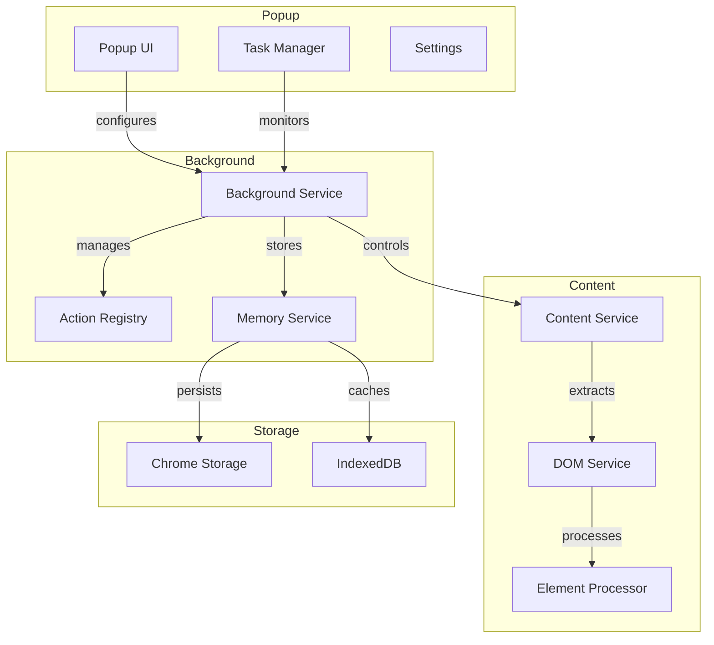

# Browser-Use Chrome Extension Specification

This document outlines the specification for converting the browser-use codebase into a Chrome extension. The extension will maintain the core functionality while adapting to Chrome's extension architecture.

## Architecture Overview



## Core Components

### 1. Background Service (`background.js`)

```javascript
class BackgroundService {
    constructor() {
        this.actionRegistry = new ActionRegistry();
        this.memoryService = new MemoryService();
        this.taskManager = new TaskManager();
    }

    // Browser Control
    async navigateTo(url) { /* ... */ }
    async goBack() { /* ... */ }
    async goForward() { /* ... */ }
    async refreshPage() { /* ... */ }

    // Tab Management
    async createTab(url) { /* ... */ }
    async switchTab(tabId) { /* ... */ }
    async closeTab(tabId) { /* ... */ }
    async getTabsInfo() { /* ... */ }

    // Action Execution
    async executeAction(action) { /* ... */ }
    async validateAction(action) { /* ... */ }
    async handleActionError(error) { /* ... */ }

    // Memory Management
    async saveState() { /* ... */ }
    async loadState() { /* ... */ }
    async clearState() { /* ... */ }
}
```

### 2. Content Service (`content.js`)

```javascript
class ContentService {
    constructor() {
        this.domService = new DOMService();
        this.elementProcessor = new ElementProcessor();
    }

    // DOM Interaction
    async clickElement(selector) { /* ... */ }
    async inputText(selector, text) { /* ... */ }
    async sendKeys(keys) { /* ... */ }
    async scrollTo(selector) { /* ... */ }

    // DOM Extraction
    async getPageState() { /* ... */ }
    async getClickableElements() { /* ... */ }
    async getElementInfo(selector) { /* ... */ }

    // Event Handling
    async handleNavigation() { /* ... */ }
    async handleDOMChanges() { /* ... */ }
    async handleNetworkRequests() { /* ... */ }
}
```

### 3. DOM Service (`dom.js`)

```javascript
class DOMService {
    constructor() {
        this.elementCache = new Map();
        this.observer = new MutationObserver();
    }

    // Element Selection
    async getElementByIndex(index) { /* ... */ }
    async getElementByXPath(xpath) { /* ... */ }
    async getElementByText(text) { /* ... */ }
    async getElementBySelector(selector) { /* ... */ }

    // DOM Analysis
    async analyzeDOM() { /* ... */ }
    async getElementHierarchy() { /* ... */ }
    async getElementAttributes() { /* ... */ }

    // Event Handling
    async observeChanges() { /* ... */ }
    async handleMutations() { /* ... */ }
}
```

### 4. Action Registry (`action-registry.js`)

```javascript
class ActionRegistry {
    constructor() {
        this.actions = new Map();
        this.registerDefaultActions();
    }

    // Action Management
    registerAction(name, handler) { /* ... */ }
    unregisterAction(name) { /* ... */ }
    getAction(name) { /* ... */ }
    validateAction(action) { /* ... */ }

    // Default Actions
    registerDefaultActions() {
        this.registerAction('click', this.handleClick);
        this.registerAction('input', this.handleInput);
        this.registerAction('scroll', this.handleScroll);
        // ... more actions
    }
}
```

### 5. Memory Service (`memory.js`)

```javascript
class MemoryService {
    constructor() {
        this.storage = chrome.storage.local;
        this.cache = new IndexedDB('browser-use-cache');
    }

    // State Management
    async saveState(state) { /* ... */ }
    async loadState() { /* ... */ }
    async clearState() { /* ... */ }

    // History Management
    async addToHistory(action) { /* ... */ }
    async getHistory() { /* ... */ }
    async clearHistory() { /* ... */ }

    // Cache Management
    async cacheElement(element) { /* ... */ }
    async getCachedElement(selector) { /* ... */ }
    async clearCache() { /* ... */ }
}
```

## Manifest Configuration

```json
{
  "manifest_version": 3,
  "name": "Browser-Use Extension",
  "version": "1.0.0",
  "description": "AI-powered browser automation extension",
  "permissions": [
    "tabs",
    "storage",
    "webNavigation",
    "webRequest",
    "scripting"
  ],
  "host_permissions": [
    "<all_urls>"
  ],
  "background": {
    "service_worker": "background.js"
  },
  "content_scripts": [{
    "matches": ["<all_urls>"],
    "js": ["content.js", "dom.js"]
  }],
  "action": {
    "default_popup": "popup.html"
  }
}
```

## Communication Flow

1. **Background to Content**:
   ```javascript
   // Background sends action
   chrome.tabs.sendMessage(tabId, {
     type: 'EXECUTE_ACTION',
     action: action
   });

   // Content receives action
   chrome.runtime.onMessage.addListener((message, sender, sendResponse) => {
     if (message.type === 'EXECUTE_ACTION') {
       contentService.executeAction(message.action);
     }
   });
   ```

2. **Content to Background**:
   ```javascript
   // Content sends state update
   chrome.runtime.sendMessage({
     type: 'STATE_UPDATE',
     state: state
   });

   // Background receives state
   chrome.runtime.onMessage.addListener((message, sender, sendResponse) => {
     if (message.type === 'STATE_UPDATE') {
       backgroundService.handleStateUpdate(message.state);
     }
   });
   ```

## Storage Strategy

1. **Chrome Storage**:
   - Persistent configuration
   - User preferences
   - Action history
   - State snapshots

2. **IndexedDB**:
   - Element cache
   - DOM snapshots
   - Temporary state
   - Performance data

## Security Considerations

1. **Content Script Isolation**:
   - Run in isolated world
   - Limited access to page context
   - Secure message passing

2. **Permission Management**:
   - Minimal required permissions
   - Granular host permissions
   - User consent for sensitive operations

3. **Data Protection**:
   - Encrypt sensitive data
   - Clear data on uninstall
   - Secure storage access

## Performance Optimization

1. **Caching**:
   - Element cache
   - DOM snapshots
   - Action results
   - State management

2. **Lazy Loading**:
   - Load components on demand
   - Defer non-critical operations
   - Optimize resource usage

3. **Memory Management**:
   - Clear unused caches
   - Limit history size
   - Optimize storage usage

## Error Handling

1. **Action Errors**:
   ```javascript
   try {
     await executeAction(action);
   } catch (error) {
     handleActionError(error);
     notifyUser(error);
     retryOrAbort(error);
   }
   ```

2. **Communication Errors**:
   ```javascript
   chrome.runtime.onMessage.addListener((message, sender, sendResponse) => {
     try {
       handleMessage(message);
     } catch (error) {
       logError(error);
       notifyBackground(error);
     }
   });
   ```

3. **Storage Errors**:
   ```javascript
   async function saveState(state) {
     try {
       await storage.set(state);
     } catch (error) {
       handleStorageError(error);
       fallbackToMemory();
     }
   }
   ```

## Testing Strategy

1. **Unit Tests**:
   - Action handlers
   - DOM services
   - Memory management
   - State handling

2. **Integration Tests**:
   - Background-Content communication
   - Storage operations
   - Action execution flow
   - Error handling

3. **E2E Tests**:
   - Complete user flows
   - Cross-tab operations
   - Performance benchmarks
   - Security validation

## Python to JavaScript Conversion

This section maps the Python browser functionality to JavaScript equivalents for the Chrome extension.

### 1. Browser Class Conversion

Python:
```python
class Browser:
    def __init__(self, config: BrowserConfig):
        self.config = config
        self.playwright = None
        self.playwright_browser = None
```

JavaScript:
```javascript
class Browser {
    constructor(config) {
        this.config = config;
        this.tabs = new Map();
        this.contexts = new Map();
    }

    // Browser instance management
    async initialize() {
        // Chrome extension doesn't need browser instance management
        // as it runs within the browser
    }

    // Context creation
    async createContext(config) {
        const context = new BrowserContext(config);
        this.contexts.set(context.id, context);
        return context;
    }
}
```

### 2. BrowserContext Conversion

Python:
```python
class BrowserContext:
    def __init__(self, config: BrowserContextConfig):
        self.config = config
        self.pages = []
```

JavaScript:
```javascript
class BrowserContext {
    constructor(config) {
        this.config = config;
        this.tabId = null;
        this.state = {
            url: null,
            title: null,
            elements: new Map()
        };
    }

    // Navigation
    async navigateTo(url) {
        await chrome.tabs.update(this.tabId, { url });
        await this.waitForNavigation();
    }

    async goBack() {
        await chrome.tabs.goBack(this.tabId);
        await this.waitForNavigation();
    }

    async goForward() {
        await chrome.tabs.goForward(this.tabId);
        await this.waitForNavigation();
    }

    async refreshPage() {
        await chrome.tabs.reload(this.tabId);
        await this.waitForNavigation();
    }

    // Tab Management
    async createTab(url) {
        const tab = await chrome.tabs.create({ url });
        this.tabId = tab.id;
        return tab;
    }

    async switchTab(tabId) {
        await chrome.tabs.update(tabId, { active: true });
        this.tabId = tabId;
    }

    async closeTab(tabId) {
        await chrome.tabs.remove(tabId);
    }

    // State Management
    async getState() {
        const [tab] = await chrome.tabs.query({ active: true, currentWindow: true });
        const state = await this.executeScript(`
            (() => {
                return {
                    url: window.location.href,
                    title: document.title,
                    elements: Array.from(document.querySelectorAll('*')).map((el, index) => ({
                        index,
                        tag: el.tagName.toLowerCase(),
                        text: el.textContent.trim(),
                        attributes: Object.fromEntries(
                            Array.from(el.attributes).map(attr => [attr.name, attr.value])
                        )
                    }))
                };
            })()
        `);
        this.state = state;
        return state;
    }

    // Element Interaction
    async clickElement(selector) {
        await this.executeScript(`
            (() => {
                const element = document.querySelector('${selector}');
                if (element) element.click();
            })()
        `);
    }

    async inputText(selector, text) {
        await this.executeScript(`
            (() => {
                const element = document.querySelector('${selector}');
                if (element) {
                    element.value = '${text}';
                    element.dispatchEvent(new Event('input', { bubbles: true }));
                    element.dispatchEvent(new Event('change', { bubbles: true }));
                }
            })()
        `);
    }

    async sendKeys(keys) {
        await this.executeScript(`
            (() => {
                const event = new KeyboardEvent('keydown', {
                    key: '${keys}',
                    code: '${keys}',
                    keyCode: '${keys}'.charCodeAt(0),
                    which: '${keys}'.charCodeAt(0),
                    bubbles: true
                });
                document.activeElement.dispatchEvent(event);
            })()
        `);
    }

    // DOM Tools
    async getElementByIndex(index) {
        return this.state.elements[index];
    }

    async getElementByXPath(xpath) {
        return await this.executeScript(`
            (() => {
                const result = document.evaluate(
                    '${xpath}',
                    document,
                    null,
                    XPathResult.FIRST_ORDERED_NODE_TYPE,
                    null
                );
                return result.singleNodeValue;
            })()
        `);
    }

    async getElementByText(text) {
        return await this.executeScript(`
            (() => {
                return Array.from(document.querySelectorAll('*')).find(
                    el => el.textContent.trim() === '${text}'
                );
            })()
        `);
    }

    // Network Tools
    async waitForNetworkIdle() {
        return new Promise(resolve => {
            let timeout;
            const listener = () => {
                clearTimeout(timeout);
                timeout = setTimeout(() => {
                    chrome.webRequest.onCompleted.removeListener(listener);
                    resolve();
                }, this.config.waitForNetworkIdleTime);
            };
            chrome.webRequest.onCompleted.addListener(listener, { urls: ['<all_urls>'] });
        });
    }

    // Utility Methods
    async executeScript(script) {
        const [result] = await chrome.scripting.executeScript({
            target: { tabId: this.tabId },
            func: new Function(script)
        });
        return result.result;
    }

    async waitForNavigation() {
        return new Promise(resolve => {
            chrome.tabs.onUpdated.addListener(function listener(tabId, changeInfo) {
                if (tabId === this.tabId && changeInfo.status === 'complete') {
                    chrome.tabs.onUpdated.removeListener(listener);
                    resolve();
                }
            });
        });
    }
}
```

### 3. Configuration Conversion

Python:
```python
class BrowserConfig:
    def __init__(
        self,
        headless=False,
        disable_security=False,
        browser_class='chromium',
        browser_binary_path=None,
        chrome_remote_debugging_port=9222,
        extra_browser_args=[],
        keep_alive=False,
        deterministic_rendering=False
    ):
        self.headless = headless
        self.disable_security = disable_security
        self.browser_class = browser_class
        self.browser_binary_path = browser_binary_path
        self.chrome_remote_debugging_port = chrome_remote_debugging_port
        self.extra_browser_args = extra_browser_args
        self.keep_alive = keep_alive
        self.deterministic_rendering = deterministic_rendering
```

JavaScript:
```javascript
class BrowserConfig {
    constructor({
        headless = false,
        disableSecurity = false,
        browserClass = 'chromium',
        browserBinaryPath = null,
        chromeRemoteDebuggingPort = 9222,
        extraBrowserArgs = [],
        keepAlive = false,
        deterministicRendering = false
    } = {}) {
        // Chrome extension doesn't need most of these settings
        // as it runs within the browser
        this.keepAlive = keepAlive;
    }
}

class BrowserContextConfig {
    constructor({
        cookiesFile = null,
        minimumWaitPageLoadTime = 0.25,
        waitForNetworkIdlePageLoadTime = 0.5,
        maximumWaitPageLoadTime = 5.0,
        waitBetweenActions = 0.5,
        browserWindowSize = { width: 1280, height: 1100 },
        highlightElements = true,
        viewportExpansion = 0,
        allowedDomains = null,
        includeDynamicAttributes = true,
        httpCredentials = null,
        isMobile = null,
        hasTouch = null,
        geolocation = null,
        permissions = null,
        timezoneId = null
    } = {}) {
        this.minimumWaitPageLoadTime = minimumWaitPageLoadTime;
        this.waitForNetworkIdlePageLoadTime = waitForNetworkIdlePageLoadTime;
        this.maximumWaitPageLoadTime = maximumWaitPageLoadTime;
        this.waitBetweenActions = waitBetweenActions;
        this.highlightElements = highlightElements;
        this.viewportExpansion = viewportExpansion;
        this.allowedDomains = allowedDomains;
        this.includeDynamicAttributes = includeDynamicAttributes;
    }
}
```

### 4. Key Differences and Adaptations

1. **Browser Instance Management**
   - Python: Manages browser instances via Playwright
   - JavaScript: Runs within Chrome, no need for browser instance management

2. **Context Management**
   - Python: Creates and manages browser contexts
   - JavaScript: Uses Chrome's tab system for context management

3. **DOM Interaction**
   - Python: Uses Playwright's DOM APIs
   - JavaScript: Uses native DOM APIs and Chrome's scripting API

4. **Network Monitoring**
   - Python: Uses Playwright's network monitoring
   - JavaScript: Uses Chrome's webRequest API

5. **State Management**
   - Python: Maintains state in memory
   - JavaScript: Uses Chrome's storage APIs and IndexedDB

6. **Security Model**
   - Python: Full browser control
   - JavaScript: Restricted by Chrome's extension security model

7. **Performance Considerations**
   - Python: Direct browser control
   - JavaScript: Message passing overhead between background and content scripts

### 5. Implementation Notes

1. **Message Passing**
   - Use Chrome's message passing API for communication
   - Implement proper error handling and timeouts
   - Consider message size limitations

2. **Storage**
   - Use Chrome's storage API for persistence
   - Implement proper data serialization
   - Handle storage quota limitations

3. **Permissions**
   - Request only necessary permissions
   - Handle permission changes gracefully
   - Implement proper error handling

4. **Performance**
   - Minimize message passing
   - Use efficient DOM operations
   - Implement proper caching
   - Handle large DOM trees efficiently

5. **Security**
   - Validate all inputs
   - Sanitize selectors and scripts
   - Handle cross-origin restrictions
   - Implement proper error handling

## Controller Conversion

This section maps the Python controller functionality to JavaScript equivalents for the Chrome extension.

### 1. Controller Class Conversion

Python:
```python
class Controller:
    def __init__(self, exclude_actions: list[str] = [], output_model: Optional[Type[BaseModel]] = None):
        self.registry = Registry(exclude_actions)
```

JavaScript:
```javascript
class Controller {
    constructor(excludeActions = [], outputModel = null) {
        this.registry = new ActionRegistry(excludeActions);
        this.outputModel = outputModel;
        this.registerDefaultActions();
    }

    // Action Registration
    registerAction(name, handler, description) {
        this.registry.registerAction(name, handler, description);
    }

    // Action Execution
    async executeAction(action, context) {
        try {
            const handler = this.registry.getAction(action.name);
            if (!handler) {
                throw new Error(`Action ${action.name} not found`);
            }
            return await handler(action.params, context);
        } catch (error) {
            return this.handleActionError(error, action);
        }
    }

    // Error Handling
    handleActionError(error, action) {
        console.error(`Action ${action.name} failed:`, error);
        return {
            success: false,
            error: error.message,
            action: action.name
        };
    }

    // Default Actions Registration
    registerDefaultActions() {
        // Navigation Actions
        this.registerAction('searchGoogle', this.handleSearchGoogle, 'Search Google with query');
        this.registerAction('goToUrl', this.handleGoToUrl, 'Navigate to URL');
        this.registerAction('goBack', this.handleGoBack, 'Navigate back');
        this.registerAction('goForward', this.handleGoForward, 'Navigate forward');

        // Element Interaction Actions
        this.registerAction('clickElement', this.handleClickElement, 'Click element by index or XPath');
        this.registerAction('inputText', this.handleInputText, 'Input text into element');
        this.registerAction('sendKeys', this.handleSendKeys, 'Send keyboard shortcuts');

        // Tab Management Actions
        this.registerAction('switchTab', this.handleSwitchTab, 'Switch to tab');
        this.registerAction('openTab', this.handleOpenTab, 'Open new tab');
        this.registerAction('closeTab', this.handleCloseTab, 'Close tab');

        // Scrolling Actions
        this.registerAction('scrollDown', this.handleScrollDown, 'Scroll down');
        this.registerAction('scrollUp', this.handleScrollUp, 'Scroll up');
        this.registerAction('scrollToText', this.handleScrollToText, 'Scroll to text');

        // Advanced Actions
        this.registerAction('dragDrop', this.handleDragDrop, 'Drag and drop elements');
        this.registerAction('extractContent', this.handleExtractContent, 'Extract page content');
        this.registerAction('savePdf', this.handleSavePdf, 'Save page as PDF');
    }
}
```

### 2. Action Registry Conversion

Python:
```python
class Registry:
    def __init__(self, exclude_actions: list[str] = []):
        self.actions = {}
        self.exclude_actions = exclude_actions
```

JavaScript:
```javascript
class ActionRegistry {
    constructor(excludeActions = []) {
        this.actions = new Map();
        this.excludeActions = new Set(excludeActions);
    }

    // Action Management
    registerAction(name, handler, description) {
        if (this.excludeActions.has(name)) {
            return;
        }
        this.actions.set(name, {
            handler,
            description
        });
    }

    getAction(name) {
        return this.actions.get(name)?.handler;
    }

    getActionDescription(name) {
        return this.actions.get(name)?.description;
    }

    getAllActions() {
        return Array.from(this.actions.entries()).map(([name, { description }]) => ({
            name,
            description
        }));
    }
}
```

### 3. Action Handlers Conversion

```javascript
class ActionHandlers {
    // Navigation Actions
    async handleSearchGoogle(params, context) {
        const { query } = params;
        await context.navigateTo(`https://www.google.com/search?q=${encodeURIComponent(query)}`);
        return { success: true, message: `Searched for "${query}"` };
    }

    async handleGoToUrl(params, context) {
        const { url } = params;
        await context.navigateTo(url);
        return { success: true, message: `Navigated to ${url}` };
    }

    async handleGoBack(context) {
        await context.goBack();
        return { success: true, message: 'Navigated back' };
    }

    // Element Interaction Actions
    async handleClickElement(params, context) {
        const { index, xpath } = params;
        let element;
        if (xpath) {
            element = await context.getElementByXPath(xpath);
        } else {
            element = await context.getElementByIndex(index);
        }
        await context.clickElement(element);
        return { success: true, message: 'Element clicked' };
    }

    async handleInputText(params, context) {
        const { index, text, xpath } = params;
        let element;
        if (xpath) {
            element = await context.getElementByXPath(xpath);
        } else {
            element = await context.getElementByIndex(index);
        }
        await context.inputText(element, text);
        return { success: true, message: 'Text input' };
    }

    async handleSendKeys(params, context) {
        const { keys } = params;
        await context.sendKeys(keys);
        return { success: true, message: `Sent keys: ${keys}` };
    }

    // Tab Management Actions
    async handleSwitchTab(params, context) {
        const { pageId } = params;
        await context.switchTab(pageId);
        return { success: true, message: `Switched to tab ${pageId}` };
    }

    async handleOpenTab(params, context) {
        const { url } = params;
        const tab = await context.createTab(url);
        return { success: true, message: `Opened tab ${tab.id}` };
    }

    async handleCloseTab(params, context) {
        const { pageId } = params;
        await context.closeTab(pageId);
        return { success: true, message: `Closed tab ${pageId}` };
    }

    // Scrolling Actions
    async handleScrollDown(params, context) {
        const { amount } = params;
        await context.scrollDown(amount);
        return { success: true, message: 'Scrolled down' };
    }

    async handleScrollUp(params, context) {
        const { amount } = params;
        await context.scrollUp(amount);
        return { success: true, message: 'Scrolled up' };
    }

    async handleScrollToText(params, context) {
        const { text } = params;
        await context.scrollToText(text);
        return { success: true, message: `Scrolled to "${text}"` };
    }

    // Advanced Actions
    async handleDragDrop(params, context) {
        const {
            elementSource,
            elementTarget,
            elementSourceOffset,
            elementTargetOffset,
            coordSourceX,
            coordSourceY,
            coordTargetX,
            coordTargetY,
            steps,
            delayMs
        } = params;

        if (elementSource && elementTarget) {
            await context.dragDropElements(
                elementSource,
                elementTarget,
                elementSourceOffset,
                elementTargetOffset,
                steps,
                delayMs
            );
        } else if (coordSourceX !== undefined && coordSourceY !== undefined &&
                   coordTargetX !== undefined && coordTargetY !== undefined) {
            await context.dragDropCoordinates(
                coordSourceX,
                coordSourceY,
                coordTargetX,
                coordTargetY,
                steps,
                delayMs
            );
        }

        return { success: true, message: 'Drag and drop completed' };
    }

    async handleExtractContent(params, context) {
        const { goal } = params;
        const content = await context.extractContent(goal);
        return { success: true, content };
    }

    async handleSavePdf(context) {
        await context.savePdf();
        return { success: true, message: 'PDF saved' };
    }
}
```

### 4. Action Models Conversion

```javascript
// Action Models
class ActionModel {
    constructor(name, params = {}) {
        this.name = name;
        this.params = params;
    }
}

// Navigation Actions
class SearchGoogleAction extends ActionModel {
    constructor(query) {
        super('searchGoogle', { query });
    }
}

class GoToUrlAction extends ActionModel {
    constructor(url) {
        super('goToUrl', { url });
    }
}

// Element Interaction Actions
class ClickElementAction extends ActionModel {
    constructor(index, xpath = null) {
        super('clickElement', { index, xpath });
    }
}

class InputTextAction extends ActionModel {
    constructor(index, text, xpath = null) {
        super('inputText', { index, text, xpath });
    }
}

class SendKeysAction extends ActionModel {
    constructor(keys) {
        super('sendKeys', { keys });
    }
}

// Tab Management Actions
class SwitchTabAction extends ActionModel {
    constructor(pageId) {
        super('switchTab', { pageId });
    }
}

class OpenTabAction extends ActionModel {
    constructor(url) {
        super('openTab', { url });
    }
}

class CloseTabAction extends ActionModel {
    constructor(pageId) {
        super('closeTab', { pageId });
    }
}

// Scrolling Actions
class ScrollAction extends ActionModel {
    constructor(amount = null) {
        super('scroll', { amount });
    }
}

// Advanced Actions
class DragDropAction extends ActionModel {
    constructor({
        elementSource = null,
        elementTarget = null,
        elementSourceOffset = null,
        elementTargetOffset = null,
        coordSourceX = null,
        coordSourceY = null,
        coordTargetX = null,
        coordTargetY = null,
        steps = 10,
        delayMs = 5
    } = {}) {
        super('dragDrop', {
            elementSource,
            elementTarget,
            elementSourceOffset,
            elementTargetOffset,
            coordSourceX,
            coordSourceY,
            coordTargetX,
            coordTargetY,
            steps,
            delayMs
        });
    }
}
```

### 5. Key Differences and Adaptations

1. **Action Registration**
   - Python: Uses decorators for action registration
   - JavaScript: Uses explicit registration methods

2. **Type System**
   - Python: Uses Pydantic for type validation
   - JavaScript: Uses class-based models and runtime checks

3. **Error Handling**
   - Python: Uses Python's exception system
   - JavaScript: Uses try-catch and custom error objects

4. **Async/Await**
   - Python: Uses async/await with asyncio
   - JavaScript: Uses native async/await

5. **Message Passing**
   - Python: Direct function calls
   - JavaScript: Chrome extension message passing

### 6. Implementation Notes

1. **Action Validation**
   - Implement runtime type checking
   - Validate action parameters
   - Handle missing or invalid parameters

2. **Error Handling**
   - Implement proper error propagation
   - Handle action execution errors
   - Provide meaningful error messages

3. **Performance**
   - Minimize message passing
   - Cache action results
   - Handle action timeouts

4. **Security**
   - Validate action parameters
   - Sanitize user input
   - Handle cross-origin restrictions

## Agent Conversion

This section maps the Python agent functionality to JavaScript equivalents for the Chrome extension.

### 1. Agent Class Conversion

Python:
```python
class Agent:
    def __init__(self, task: str, llm: BaseChatModel, browser: Browser | None = None, ...):
        self.task = task
        self.llm = llm
        self.browser = browser
        self.controller = Controller()
        self.message_manager = MessageManager()
        self.memory = Memory()
```

JavaScript:
```javascript
class Agent {
    constructor({
        task,
        llm,
        browser = null,
        controller = new Controller(),
        messageManager = new MessageManager(),
        memory = new Memory(),
        settings = {}
    }) {
        this.task = task;
        this.llm = llm;
        this.browser = browser;
        this.controller = controller;
        this.messageManager = messageManager;
        this.memory = memory;
        this.settings = {
            maxSteps: 100,
            maxFailures: 3,
            useVision: false,
            enableMemory: true,
            ...settings
        };
        this.state = {
            nSteps: 0,
            consecutiveFailures: 0,
            history: [],
            lastResult: null
        };
    }

    // Core Functions
    async run(maxSteps = this.settings.maxSteps) {
        try {
            while (this.state.nSteps < maxSteps) {
                await this.step();
                if (this.state.consecutiveFailures >= this.settings.maxFailures) {
                    throw new Error('Max consecutive failures reached');
                }
            }
            return this.state.history;
        } catch (error) {
            await this.handleError(error);
            return this.state.history;
        }
    }

    async step() {
        const stepStartTime = Date.now();
        try {
            // Get current state
            const state = await this.browser.getState();
            
            // Get next action
            const action = await this.getNextAction();
            
            // Execute action
            const result = await this.multiAct(action);
            
            // Update history
            this.updateHistory(action, state, result, stepStartTime);
            
            // Update memory
            if (this.settings.enableMemory) {
                await this.memory.addStep(this.state.history[this.state.history.length - 1]);
            }
            
            this.state.nSteps++;
            this.state.consecutiveFailures = 0;
        } catch (error) {
            this.state.consecutiveFailures++;
            await this.handleStepError(error);
        }
    }

    async getNextAction() {
        const messages = this.messageManager.getMessages();
        const response = await this.llm.generate(messages);
        return this.parseAction(response);
    }

    async multiAct(actions) {
        const results = [];
        for (const action of actions) {
            try {
                const result = await this.controller.executeAction(action, this.browser);
                results.push(result);
            } catch (error) {
                results.push(this.handleActionError(error, action));
            }
        }
        return results;
    }

    // State Management
    async updateActionModelsForPage() {
        const state = await this.browser.getState();
        this.controller.updateAvailableActions(state);
    }

    async handleStepError(error) {
        console.error('Step error:', error);
        return {
            success: false,
            error: error.message,
            step: this.state.nSteps
        };
    }

    // History Management
    async rerunHistory(history, maxRetries = 3) {
        const results = [];
        for (const item of history) {
            try {
                const result = await this.executeHistoryStep(item);
                results.push(result);
            } catch (error) {
                if (maxRetries > 0) {
                    await this.rerunHistory([item], maxRetries - 1);
                } else {
                    results.push(this.handleActionError(error, item.action));
                }
            }
        }
        return results;
    }

    // Utility Functions
    pause() {
        this.state.paused = true;
    }

    resume() {
        this.state.paused = false;
    }

    async close() {
        if (this.browser) {
            await this.browser.close();
        }
        if (this.memory) {
            await this.memory.close();
        }
    }
}
```

### 2. Message Manager Conversion

Python:
```python
class MessageManager:
    def __init__(self):
        self.messages = []
        self.system_prompt = "..."
```

JavaScript:
```javascript
class MessageManager {
    constructor() {
        this.messages = [];
        this.systemPrompt = `You are an AI assistant that helps users automate web tasks.
            You have access to a browser and can perform various actions.
            Always think step by step and explain your reasoning.`;
    }

    getMessages() {
        return [
            { role: 'system', content: this.systemPrompt },
            ...this.messages
        ];
    }

    addMessage(role, content) {
        this.messages.push({ role, content });
    }

    clearMessages() {
        this.messages = [];
    }
}
```

### 3. Memory System Conversion

Python:
```python
class Memory:
    def __init__(self, config: MemoryConfig):
        self.config = config
        self.embeddings = []
```

JavaScript:
```javascript
class Memory {
    constructor(config = {}) {
        this.config = {
            memoryInterval: 5,
            maxMemoryItems: 10,
            ...config
        };
        this.embeddings = [];
        this.storage = chrome.storage.local;
    }

    async addStep(step) {
        if (this.embeddings.length % this.config.memoryInterval === 0) {
            const embedding = await this.createEmbedding(step);
            this.embeddings.push(embedding);
            await this.saveEmbeddings();
        }
    }

    async createEmbedding(step) {
        // Use a text embedding model to create embeddings
        const text = this.formatStepForEmbedding(step);
        return await this.embeddingModel.embed(text);
    }

    async saveEmbeddings() {
        await this.storage.set({ embeddings: this.embeddings });
    }

    async loadEmbeddings() {
        const data = await this.storage.get('embeddings');
        this.embeddings = data.embeddings || [];
    }

    formatStepForEmbedding(step) {
        return JSON.stringify({
            action: step.action,
            result: step.result,
            state: step.state
        });
    }
}
```

### 4. Error Handling Conversion

```javascript
class AgentError extends Error {
    constructor(message, type, details = {}) {
        super(message);
        this.type = type;
        this.details = details;
    }

    static formatError(error, includeTrace = false) {
        return {
            message: error.message,
            type: error.type || 'unknown',
            details: error.details || {},
            stack: includeTrace ? error.stack : undefined
        };
    }
}

class ErrorHandler {
    static async handleStepError(error, agent) {
        const formattedError = AgentError.formatError(error);
        agent.state.consecutiveFailures++;
        
        if (agent.state.consecutiveFailures >= agent.settings.maxFailures) {
            throw new AgentError(
                'Max consecutive failures reached',
                'max_failures',
                { failures: agent.state.consecutiveFailures }
            );
        }
        
        return {
            success: false,
            error: formattedError,
            step: agent.state.nSteps
        };
    }

    static async handleActionError(error, action) {
        return {
            success: false,
            error: AgentError.formatError(error),
            action: action.name
        };
    }
}
```

### 5. State Management Conversion

```javascript
class AgentState {
    constructor() {
        this.nSteps = 0;
        this.consecutiveFailures = 0;
        this.history = [];
        this.lastResult = null;
        this.paused = false;
    }

    addHistoryItem(item) {
        this.history.push(item);
    }

    getLastHistoryItem() {
        return this.history[this.history.length - 1];
    }

    clearHistory() {
        this.history = [];
    }
}

class StepMetadata {
    constructor(stepNumber, stepStartTime) {
        this.stepNumber = stepNumber;
        this.stepStartTime = stepStartTime;
        this.stepEndTime = Date.now();
        this.duration = this.stepEndTime - this.stepStartTime;
    }
}
```

### 6. Key Differences and Adaptations

1. **LLM Integration**
   - Python: Uses LangChain for LLM integration
   - JavaScript: Uses direct API calls to LLM services

2. **Memory Management**
   - Python: Uses Python's memory management
   - JavaScript: Uses Chrome's storage APIs

3. **Error Handling**
   - Python: Uses Python's exception system
   - JavaScript: Uses custom error classes and Chrome's error handling

4. **State Management**
   - Python: Uses Python's class system
   - JavaScript: Uses Chrome's storage and IndexedDB

5. **Message Passing**
   - Python: Direct function calls
   - JavaScript: Chrome extension message passing

### 7. Implementation Notes

1. **LLM Integration**
   - Implement proper API key management
   - Handle rate limiting
   - Implement retry logic
   - Cache responses when appropriate

2. **Memory Management**
   - Use efficient storage strategies
   - Implement proper cleanup
   - Handle storage quota limits
   - Optimize embedding creation

3. **Error Handling**
   - Implement proper error propagation
   - Handle network errors
   - Manage retry logic
   - Provide meaningful error messages

4. **Performance**
   - Minimize message passing
   - Optimize state updates
   - Implement proper caching
   - Handle large histories efficiently

## DOM Processing Conversion

This section maps the Python DOM processing functionality to JavaScript equivalents for the Chrome extension.

### 1. DOM Service Conversion

Python:
```python
class DomService:
    def __init__(self):
        self.element_cache = {}
        self.observer = None
```

JavaScript:
```javascript
class DOMService {
    constructor() {
        this.elementCache = new Map();
        this.observer = null;
        this.includeAttributes = [
            'title', 'type', 'name', 'role', 'aria-label',
            'placeholder', 'value', 'alt', 'aria-expanded'
        ];
    }

    // Element Selection
    isInteractiveElement(element) {
        const tag = element.tagName.toLowerCase();
        const role = element.getAttribute('role');
        const type = element.getAttribute('type');
        
        return (
            tag === 'a' ||
            tag === 'button' ||
            tag === 'input' ||
            tag === 'select' ||
            tag === 'textarea' ||
            role === 'button' ||
            role === 'link' ||
            role === 'menuitem' ||
            (tag === 'input' && type === 'submit') ||
            (tag === 'input' && type === 'button')
        );
    }

    isElementVisible(element) {
        const style = window.getComputedStyle(element);
        return (
            style.display !== 'none' &&
            style.visibility !== 'hidden' &&
            style.opacity !== '0' &&
            element.offsetWidth > 0 &&
            element.offsetHeight > 0
        );
    }

    isTopElement(element) {
        const rect = element.getBoundingClientRect();
        const elements = document.elementsFromPoint(
            rect.left + rect.width / 2,
            rect.top + rect.height / 2
        );
        return elements[0] === element;
    }

    isInExpandedViewport(element) {
        const rect = element.getBoundingClientRect();
        const viewportHeight = window.innerHeight;
        const viewportWidth = window.innerWidth;
        
        return (
            rect.top >= 0 &&
            rect.left >= 0 &&
            rect.bottom <= viewportHeight &&
            rect.right <= viewportWidth
        );
    }

    // Element Processing
    processElement(element, index) {
        return {
            tagName: element.tagName.toLowerCase(),
            xpath: this.getXPath(element),
            attributes: this.getAttributes(element),
            isInteractive: this.isInteractiveElement(element),
            isTopElement: this.isTopElement(element),
            isInViewport: this.isInExpandedViewport(element),
            highlightIndex: index,
            text: this.getTextContent(element)
        };
    }

    getXPath(element) {
        if (!element) return '';
        if (element.id) return `//*[@id="${element.id}"]`;
        
        const parts = [];
        while (element && element.nodeType === Node.ELEMENT_NODE) {
            let sibling = element;
            let count = 1;
            while (sibling = sibling.previousElementSibling) {
                if (sibling.tagName === element.tagName) count++;
            }
            parts.unshift(`${element.tagName.toLowerCase()}[${count}]`);
            element = element.parentNode;
        }
        return '/' + parts.join('/');
    }

    getAttributes(element) {
        const attributes = {};
        for (const attr of this.includeAttributes) {
            const value = element.getAttribute(attr);
            if (value) {
                attributes[attr] = value;
            }
        }
        return attributes;
    }

    getTextContent(element) {
        let text = '';
        const walker = document.createTreeWalker(
            element,
            NodeFilter.SHOW_TEXT,
            null,
            false
        );
        
        let node;
        while (node = walker.nextNode()) {
            text += node.textContent.trim() + ' ';
        }
        
        return text.trim();
    }

    // DOM Analysis
    async analyzeDOM() {
        const elements = Array.from(document.querySelectorAll('*'));
        const processedElements = [];
        let index = 0;

        for (const element of elements) {
            if (
                this.isInteractiveElement(element) &&
                this.isElementVisible(element) &&
                this.isTopElement(element) &&
                this.isInExpandedViewport(element)
            ) {
                processedElements.push(this.processElement(element, index++));
            }
        }

        return processedElements;
    }

    // Context Building
    buildContext(elements) {
        let context = '[Start of page]\n';
        
        for (const element of elements) {
            // Add element with index
            context += `[${element.highlightIndex}]<${element.tagName}`;
            
            // Add attributes
            for (const [key, value] of Object.entries(element.attributes)) {
                context += ` ${key}='${value}'`;
            }
            
            context += ' />\n';
            
            // Add text content
            if (element.text) {
                context += element.text + '\n';
            }
        }
        
        context += '[End of page]';
        return context;
    }

    // Screenshot Handling
    async takeScreenshot() {
        return new Promise((resolve) => {
            chrome.tabs.captureVisibleTab(null, { format: 'png' }, (dataUrl) => {
                resolve(dataUrl);
            });
        });
    }

    // Event Handling
    observeChanges() {
        this.observer = new MutationObserver((mutations) => {
            this.handleMutations(mutations);
        });

        this.observer.observe(document.body, {
            childList: true,
            subtree: true,
            attributes: true,
            attributeFilter: this.includeAttributes
        });
    }

    handleMutations(mutations) {
        for (const mutation of mutations) {
            if (mutation.type === 'attributes') {
                this.updateElementCache(mutation.target);
            } else if (mutation.type === 'childList') {
                this.updateElementCache(mutation.target);
            }
        }
    }

    updateElementCache(element) {
        const xpath = this.getXPath(element);
        if (this.elementCache.has(xpath)) {
            this.elementCache.set(xpath, this.processElement(element));
        }
    }
}
```

### 2. Element Processor Conversion

```javascript
class ElementProcessor {
    constructor() {
        this.domService = new DOMService();
    }

    async processPage() {
        // Analyze DOM
        const elements = await this.domService.analyzeDOM();
        
        // Build context
        const context = this.domService.buildContext(elements);
        
        // Take screenshot if needed
        let screenshot = null;
        if (this.settings.useVision) {
            screenshot = await this.domService.takeScreenshot();
        }
        
        return {
            elements,
            context,
            screenshot
        };
    }

    getElementByIndex(index) {
        return this.domService.elementCache.get(index);
    }

    getElementByXPath(xpath) {
        return document.evaluate(
            xpath,
            document,
            null,
            XPathResult.FIRST_ORDERED_NODE_TYPE,
            null
        ).singleNodeValue;
    }

    getElementByText(text) {
        return Array.from(document.querySelectorAll('*')).find(
            element => element.textContent.trim() === text
        );
    }
}
```

### 3. DOM Representation Example

```javascript
// Example HTML page processing
const html = `
<!DOCTYPE html>
<html>
<head>
    <title>Online Store</title>
</head>
<body>
    <header>
        <nav>
            <div class="search-container">
                <input type="text" placeholder="Search products..." id="search-input">
                <button type="submit" class="search-btn">Search</button>
            </div>
            <a href="/cart" class="cart-link">Cart (2 items)</a>
        </nav>
    </header>
    <main>
        <h1>Featured Products</h1>
        <div class="product-card">
            <h2>Organic Apples</h2>
            <p>Fresh organic apples from local farms</p>
            <p class="price">$2.99/lb</p>
            <button class="btn-primary">Add to Cart</button>
        </div>
    </main>
</body>
</html>
`;

// Process the page
const processor = new ElementProcessor();
const result = await processor.processPage();

// Result will contain:
{
    elements: [
        {
            tagName: 'input',
            xpath: '//*[@id="search-input"]',
            attributes: {
                type: 'text',
                placeholder: 'Search products...',
                id: 'search-input'
            },
            isInteractive: true,
            isTopElement: true,
            isInViewport: true,
            highlightIndex: 0,
            text: ''
        },
        {
            tagName: 'button',
            xpath: '/html/body/header/nav/div[2]/button[1]',
            attributes: {
                type: 'submit',
                class: 'search-btn'
            },
            isInteractive: true,
            isTopElement: true,
            isInViewport: true,
            highlightIndex: 1,
            text: 'Search'
        },
        // ... more elements
    ],
    context: `[Start of page]
[0]<input type='text' placeholder='Search products...' id='search-input' />
[1]<button type='submit' class='search-btn'>Search</button>
[2]<a href='/cart' class='cart-link'>Cart (2 items)</a>
Featured Products
[3]<h2>Organic Apples</h2>
Fresh organic apples from local farms
$2.99/lb
[4]<button class='btn-primary'>Add to Cart</button>
[End of page]`,
    screenshot: 'data:image/png;base64,...' // If useVision is true
}
```

### 4. Key Differences and Adaptations

1. **DOM Access**
   - Python: Uses Playwright's DOM APIs
   - JavaScript: Uses native DOM APIs

2. **Element Selection**
   - Python: Uses Playwright's element selectors
   - JavaScript: Uses native querySelector and XPath

3. **Event Handling**
   - Python: Uses Playwright's event system
   - JavaScript: Uses native MutationObserver

4. **Screenshot Capture**
   - Python: Uses Playwright's screenshot API
   - JavaScript: Uses Chrome's tabs.captureVisibleTab

### 5. Implementation Notes

1. **Performance**
   - Cache computed styles and bounding rectangles
   - Minimize DOM traversals
   - Use efficient element location strategies
   - Handle large DOM trees efficiently

2. **Memory Management**
   - Clear element cache periodically
   - Handle memory leaks from observers
   - Manage screenshot data efficiently

3. **Error Handling**
   - Handle DOM mutation errors
   - Manage element not found cases
   - Handle screenshot capture failures

4. **Security**
   - Sanitize XPath expressions
   - Validate element attributes
   - Handle cross-origin restrictions

// ... rest of existing content ... 