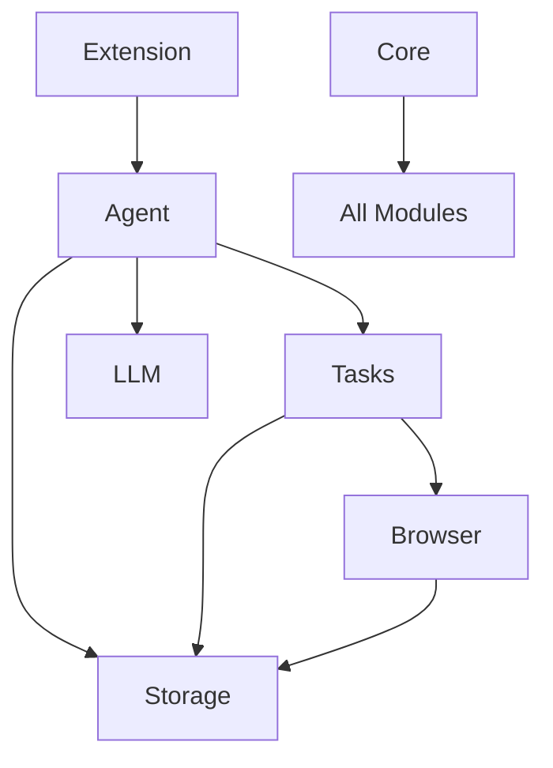

# Browser-Use Extension: Modular Architecture V1

## Overview

This document outlines a highly modular architecture for the Browser-Use Chrome Extension, designed to maximize maintainability, testability, and extensibility. The architecture separates concerns into distinct modules with clear boundaries and responsibilities.

## Module Structure

### 1. Core Agent Module
Core orchestration layer responsible for task planning and execution.

```
agent/
  - planner.ts          # Task planning and decomposition
  - executor.ts         # Task execution orchestration
  - memory/
    - short_term.ts     # Working memory for current task
    - long_term.ts      # Persistent memory across sessions
  - types/
    - task.ts          # Task and subtask interfaces
    - plan.ts          # Planning interfaces
```

**Key Responsibilities:**
- Task decomposition and planning
- Orchestrating task execution
- Managing task state and memory
- Coordinating between other modules

**Example Interface:**
```typescript
interface Agent {
  plan(task: Task): Promise<Plan>;
  execute(plan: Plan): Promise<Result>;
  remember(memory: Memory): void;
  recall(query: Query): Memory[];
}
```

### 2. LLM Module
Handles all AI/Language Model interactions.

```
llm/
  - client/
    - base.ts          # Abstract LLM client interface
    - openai.ts        # OpenAI implementation
    - anthropic.ts     # Anthropic implementation
  - prompt/
    - templates.ts     # Reusable prompt templates
    - builder.ts       # Prompt construction utilities
  - types/
    - response.ts      # LLM response interfaces
```

**Key Responsibilities:**
- Managing API connections to LLM providers
- Prompt template management
- Response parsing and error handling
- Rate limiting and retry logic

**Example Interface:**
```typescript
interface LLMClient {
  complete(prompt: string): Promise<LLMResponse>;
  stream(prompt: string): AsyncIterator<LLMResponse>;
  embedText(text: string): Promise<number[]>;
}
```

### 3. Storage Module
Handles all data persistence needs.

```
storage/
  - adapters/
    - base.ts          # Abstract storage interface
    - chrome.ts        # Chrome storage implementation
    - indexdb.ts       # IndexedDB implementation
  - models/
    - task.ts          # Task storage models
    - history.ts       # History storage models
  - migrations/        # Storage schema migrations
```

**Key Responsibilities:**
- Data persistence across sessions
- Schema management and migrations
- Caching and optimization
- Data encryption (when needed)

**Example Interface:**
```typescript
interface StorageAdapter {
  get<T>(key: string): Promise<T>;
  set<T>(key: string, value: T): Promise<void>;
  delete(key: string): Promise<void>;
  clear(): Promise<void>;
}
```

### 4. Browser Interaction Module
Manages all browser-related operations.

```
browser/
  - dom/
    - interactor.ts    # DOM manipulation
    - observer.ts      # DOM change detection
    - selector.ts      # Element selection strategies
  - tools/
    - navigation.ts    # Page navigation
    - input.ts         # Form interactions
    - extraction.ts    # Data extraction
  - context/
    - capture.ts       # Page context capture
    - analyzer.ts      # Context analysis
  - types/
    - action.ts        # Browser action interfaces
```

**Key Responsibilities:**
- DOM manipulation and observation
- Page navigation and interaction
- Data extraction and injection
- Context analysis and capture

**Example Interface:**
```typescript
interface BrowserModule {
  navigate(url: string): Promise<void>;
  click(selector: string): Promise<void>;
  extract(selector: string): Promise<string>;
  observe(selector: string, callback: Function): void;
}
```

### 5. Extension Module
Chrome-specific implementation.

```
extension/
  - background/
    - service.ts       # Service worker
    - router.ts        # Message routing
  - content/
    - script.ts        # Content script
    - bridge.ts        # DOM-Extension bridge
  - popup/
    - ui/             # UI components
    - state/          # UI state management
  - messaging/
    - protocol.ts     # Messaging protocol
    - handlers.ts     # Message handlers
```

**Key Responsibilities:**
- Chrome extension lifecycle management
- Message routing between components
- UI management
- Extension-specific configuration

### 6. Task Module
Manages task workflows and execution.

```
tasks/
  - registry/
    - actions.ts       # Available actions
    - validators.ts    # Action validation
  - workflow/
    - builder.ts       # Workflow construction
    - executor.ts      # Workflow execution
  - types/
    - workflow.ts      # Workflow interfaces
```

**Key Responsibilities:**
- Action registry management
- Workflow construction and validation
- Task execution and monitoring
- Error handling and recovery

### 7. Core Module
Shared utilities and types.

```
core/
  - utils/
    - logger.ts
    - error.ts
    - validation.ts
  - types/
    - common.ts
  - config/
    - settings.ts
```

**Key Responsibilities:**
- Shared utility functions
- Common type definitions
- Configuration management
- Error handling utilities

## Implementation Guidelines

### 1. Dependency Management
```typescript
// Use dependency injection
class AgentImpl implements Agent {
  constructor(
    private llm: LLMClient,
    private storage: StorageAdapter,
    private browser: BrowserModule
  ) {}
}
```

### 2. Communication Patterns
```typescript
// Event-based communication
interface EventBus {
  emit(event: string, data: any): void;
  on(event: string, handler: Function): void;
}
```

### 3. Error Handling
```typescript
// Centralized error handling
class ErrorHandler {
  handle(error: Error): void {
    logger.error(error);
    metrics.recordError(error);
    ui.showError(error);
  }
}
```

### 4. Testing Strategy

```
tests/
  - unit/             # Unit tests per module
  - integration/      # Cross-module integration
  - e2e/             # End-to-end workflows
  - mocks/           # Mock implementations
```

Example test:
```typescript
describe('Agent', () => {
  it('should plan task execution', async () => {
    const agent = new AgentImpl(mockLLM, mockStorage, mockBrowser);
    const plan = await agent.plan(task);
    expect(plan.steps).toHaveLength(3);
  });
});
```

## Module Dependencies



## Configuration Management

```typescript
// Centralized configuration
interface Config {
  llm: {
    provider: string;
    apiKey: string;
    maxRetries: number;
  };
  storage: {
    encryption: boolean;
    maxSize: number;
  };
  browser: {
    timeout: number;
    retryInterval: number;
  };
}
```

## Security Considerations

1. **Data Security**
   - Encrypt sensitive data in storage
   - Sanitize all inputs
   - Validate all actions before execution

2. **Permission Management**
   - Minimal required permissions
   - Clear user consent flows
   - Secure message passing

3. **Error Handling**
   - Graceful degradation
   - User-friendly error messages
   - Detailed logging for debugging

## Future Extensions

1. **Plugin System**
   ```typescript
   interface Plugin {
     name: string;
     initialize(): Promise<void>;
     getActions(): Action[];
   }
   ```

2. **Custom Action Support**
   ```typescript
   interface CustomAction {
     name: string;
     validate(params: any): boolean;
     execute(params: any): Promise<any>;
   }
   ```

3. **Multi-Provider Support**
   - Multiple LLM providers
   - Different storage backends
   - Cross-browser compatibility

## Version Control and Release Strategy

1. **Semantic Versioning**
   - Major: Breaking changes
   - Minor: New features
   - Patch: Bug fixes

2. **Release Process**
   - Feature branches
   - PR reviews
   - Automated testing
   - Staged rollouts

## Metrics and Monitoring

1. **Performance Metrics**
   - Action execution time
   - Memory usage
   - API latency

2. **Error Tracking**
   - Error rates
   - Stack traces
   - User impact

3. **Usage Analytics**
   - Feature usage
   - User patterns
   - Success rates

## Getting Started

1. **Development Setup**
   ```bash
   npm install
   npm run dev
   ```

2. **Building**
   ```bash
   npm run build
   ```

3. **Testing**
   ```bash
   npm run test
   npm run test:e2e
   ```

## Contributing

1. Fork the repository
2. Create a feature branch
3. Submit a pull request
4. Ensure tests pass
5. Update documentation

---

This modular architecture provides a solid foundation for building a robust, maintainable, and extensible browser automation system. Each module has clear responsibilities and boundaries, making it easier to develop, test, and maintain the codebase. 